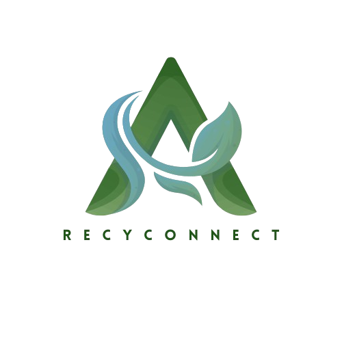
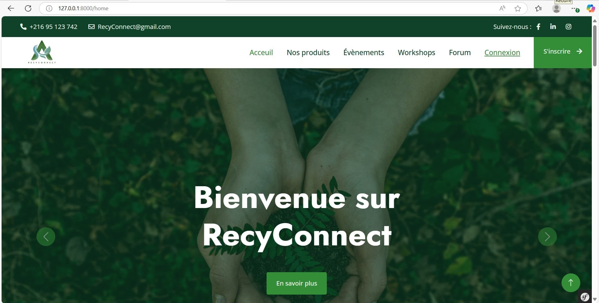

#  RecyConnect – Application Web


**RecyConnect** est une application web conçue pour établir un lien efficace entre différents acteurs du domaine de la gestion durable des déchets, notamment :

- les **supermarchés**
- les **restaurants**
- les **associations**
- les **usines de recyclage**
- les **particuliers**

## 🎯 Objectifs

L'objectif principal de RecyConnect est de **promouvoir la réutilisation et le recyclage** à travers :

- l’**échange de produits** entre producteurs et valorisateurs,
- la **publication de demandes** de récupération ou de valorisation de déchets,
- la **sensibilisation** du public grâce à des **événements** et **formations**.

## 🌱 Démarche éco-responsable

Ce projet s’inscrit dans une approche durable en contribuant :

- à la **réduction des déchets**,
- à l’encouragement d’une **économie circulaire**,
- et à l’atteinte des **Objectifs de Développement Durable (ODD)**
---
## 🎯 Objectifs de Développement Durable (ODD)

RecyConnect s’inscrit pleinement dans une démarche éco-responsable en répondant à plusieurs **Objectifs de Développement Durable (ODD)** définis par les Nations Unies :

<table>
  <tr>
    <td align="center">
      <br/>
      <strong>ODD 8</strong><br/>
      Travail décent et croissance économique
    </td>
    <td align="center">
      <br/>
      <strong>ODD 11</strong><br/>
      Villes et communautés durables
    </td>
    <td align="center">
      <br/>
      <strong>ODD 12</strong><br/>
      Consommation et production responsables
    </td>
    <td align="center">
      <br/>
      <strong>ODD 13</strong><br/>
      Lutte contre le changement climatique
    </td>
  </tr>
</table>

## ✨ Fonctionnalités principales

- 🔐 **Gestion des utilisateurs**
  - Création de compte avec reconnaissance faciale
  - Authentification sécurisée
  - Activation/désactivation de comptes par l'administrateur

- 📦 **Gestion des articles**
  - Ajout, modification, suppression et catégorisation des articles
  - Modération des images avec API Sightengine
  - Notification par email en cas de refus

- 🛒 **Gestion des commandes**
  - Ajout au panier, modification des quantités, suppression
  - Paiement via Paymee ou à la livraison
  - Génération de factures PDF

- 📝 **Gestion des posts (Forum)**
  - Création de publications avec médias
  - Filtrage par tags
  - Likes, commentaires, réponses imbriquées
  - Validation de contenu avec Gemini API

- 📆 **Gestion des événements**
  - Création, modification et suppression d'événements (en ligne ou sur site)
  - Intégration avec Jitsi Meet pour les visioconférences
  - Affichage de la carte avec Leaflet et géolocalisation via Nominatim

- 🧪 **Gestion des workshops**
  - Ajout, modification, suppression de workshops
  - Attribution de notes (1 à 5), filtrage, affichage des moyennes
  - Statistiques par catégorie, chatbot intégré, vidéo explicative
  - Génération automatique de description via analyse vidéo (IA)

---

## 🧰 Technologies utilisées

### 👨‍💻 Backend & Frontend

- **Symfony (PHP)** – Framework backend MVC puissant et maintenable
- **Twig** – Moteur de templates intégré à Symfony
- **Bootstrap** – Framework CSS pour un design responsive et moderne
- **JavaScript** – Pour l’interactivité côté client
- **MySQL** – Base de données relationnelle pour le stockage des données

### 🔌 APIs & Intégrations externes

- 🔐 [**Google Authentication**](https://developers.google.com/identity) – Connexion sécurisée via un compte Google.  
- 📬 [**MailerSend**](https://www.mailersend.com/) – Envoi d’e-mails transactionnels (validation, notifications, confirmations…).  
- 🤖 [**Chatbot intégré**](https://huggingface.co/) Interaction automatisée avec les utilisateurs pour l’assistance ou les réponses fréquentes.  
- 💳 [**Paymee (sandbox)**](https://sandbox.paymee.tn/) – Paiement sécurisé en ligne adapté au marché tunisien.  
- 🗺️ [**Leaflet**](https://leafletjs.com/) – Affichage de cartes interactives pour géolocalisation et navigation.  
- 🎥 [**Jitsi Meet**](https://jitsi.org/jitsi-meet/) – Intégration de visioconférence pour des réunions ou consultations en ligne.
- 🧹 [**Purgomalum**](https://www.purgomalum.com/service/json) – Filtrage automatique des mots inappropriés dans les textes via une API simple et rapide.


### 🧠 Intelligence Artificielle & IA appliquée

- **Chatbot intelligent** – Réponses automatiques aux questions fréquentes
- **Filtrage de mots inappropriés** – Détection et suppression automatique des termes offensants dans les textes.


---
## 📸 Aperçu de l’application
Voici quelques captures d’écran de l’interface utilisateur de RecyConnect :

### 🖼️ Accueil de l'application
<p align="center">

</p>

### 🛍️ Nos services
<p align="center">

</p>
---


## 📚 Projet académique

Ce projet a été réalisé dans le cadre d’un **projet académique** au sein de l’école d’ingénierie **ESPRIT** (École Supérieure Privée d'Ingénierie et de Technologies).  
Il démontre la capacité à concevoir une solution web complète, fonctionnelle et engagée, en intégrant des technologies avancées telles que **Symfony**, des **API d’intelligence artificielle** et des outils axés sur le **développement durable**.


---

## 👥 Équipe projet – TechSquad

Ce projet a été réalisé dans le cadre d’un projet académique à l’école **ESPRIT**, par un groupe de 6 étudiantes en ingénierie informatique, passionnées par l’innovation durable et l’intelligence artificielle.

**Membres de l'équipe : TechSquad**
- Sahar Mnif  
- Zeineb Nsiri  
- Mohamed Aziz Zouari
- Samar Touil
- Amal Eljazi
- Eya Guirat

Nous avons collaboré sur toutes les étapes du projet : conception, développement, intégration d'API et documentation. Ce travail reflète notre engagement pour un avenir plus vert et plus intelligent 🌍🤖.

## 🏁 Lancement du projet

1. **Cloner le dépôt**
   ```bash
   git clone https://github.com/ZeinebNsiri/PI_RecyConnect_TechSquad.git
   ```

---
